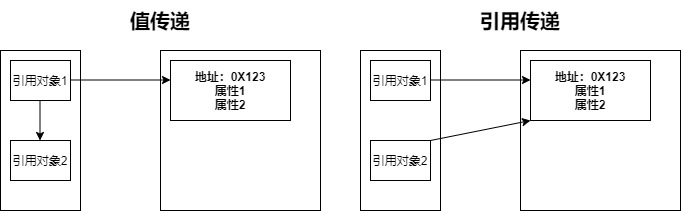

# 方法的组成

函数，也可以称作方法：**用于抽取、封装某一段功能代码**

```java
public static void main(String[] args) {
   
}
修饰符 返回值 函数名（参数列表） {
   函数体
}
```

一个标准的函数由以下几个部分组成

- 修饰符：表示不同的目的，例如 `public`、`static`
- 返回值类型：声明该函数的返回值类型，可以不存在返回值，写作 `void`
- 函数名：函数的名称
- 参数列表：声明该函数调用时可以接收的参数，可以是原始类型、引用类型
- 函数体：函数中具体的代码块
- 返回值：函数执行后产生的结果

# 方法的参数传递

在函数的调用过程中，可以同时传入若干个任意类型的参数

对于传入的参数，也分为原始类型、引用类型两类

整数、浮点数、字符，或者引用类型的数组、自定义类，都是可以的

值得注意的是，在 Java 中，**函数的参数传递，只存在值传递**

值传递：参数传递时，形参接收的是实参的实际数据的拷贝副本

引用传递：参数传递时，形参接收的是实参的引用地址的拷贝副本

**Java 的参数传递极易混淆，而 Java 官方已经定义，Java 中只存在值传递**

Java 就是值传递，只不过是将对象的引用当做值传递给方法，即值传递中的按引用传递

值传递示例（原始类型）：

```java
public static void main(String[] args) {
    int a = 10;
    int b = 20;
    set(a, b);
    System.out.println("=====");
    System.out.println(a);
    System.out.println(b);
    /* 20、10、=====、10、20 */
}

public static void set(int a, int b) {
    a = 20;
    b = 10;
    System.out.println(a);
    System.out.println(b);
}
```

值传递示例（引用类型）：

```java
public static void main(String[] args) {
    int[] ints = {1, 2};
    System.out.println(Arrays.toString(ints));
    set(ints);
    System.out.println(Arrays.toString(ints));
    /* [1, 2]、[2, 2] */
}

public static void set(int[] array) {
    array[0] = 2;
}
```

在上述的两个示例中，原始类型的传参，实际参数不受形参变化的影响，不做考虑

而对于引用参数的传递，形参的修改，实参也随之修改，看似不符合值传递的定义

**当传递的是引用类型，拷贝的副本是对象的引用地址**

简单的理解，形参得到实参的拷贝副本，间接的获得引用地址，可以修改堆内存的数据

值传递的引用类型，在此刻，与引用传递十分相似

不同的是，真正的引用传递，**形参是直接获得引用地址，并可以对该地址做出修改**



上图，是关于值传递、引用传递的简单说明，**真正意义上的引用传递，可以参考 Rust 语言，讲述清晰**

在值传递中，引用对象 2 获得的仅仅是堆内存地址的拷贝副本，只存在访问、修改堆内存数据的权限

而在引用传递中，引用对象 2 直接获得了堆内存的 root 权限，可以直接修改其引用地址

姑且，将值传递再细分为按值传递、按引用传递

只需要牢记两点

- 值传递，形参尽可以修改内容
- 引用传递，形参可以修改引用地址

**在 Java 中，只存在值传递，且传递的是引用地址的拷贝，仅可以操作内存数据**

# 方法的可变长参数

当函数的 **传入参数数目不确定** 时，可以使用 ` 可变长参数 ` 进行定义，例如排序方法

以下代码是关乎可变长参数的使用案例

```java
public static void main(String[] args) {
    get(12, 12, 23, 34, 45, 34, 23);
}

public static void get(int... a) {
    System.out.println(Arrays.toString(a));
}
```

对于可变长参数的使用，需要注意两点：

1. 可变长参数必须放在参数列表的末位
2. 一个函数的参数列表，仅可以存在一个可变长参数

方法的可变长参数，实质上就是数组的体现，建议使用数组对象进行传参，也更易于理解

```java
public void get(int[] a, String[] b) {}
```

函数的参数列表中，两个 **不同类型的可变长参数也不可以共存**，而数组可以做到

# 方法的重载

当类中，存在多个同名方法时，这就是方法重载的体现

**函数重载：重载仅是 ` 方法名的相同 `，参数列表、访问修饰符、返回值类型可以不同**

以下是方法重载的代码示例

```JAVA
public static void main(String[] args) {
    get((byte) 1);
    Integer integer = get((short) 1);
    get(1);
    get((long) 1);
}

private static void get(byte... a) {
    System.out.println("byte");
}

public static Integer get(short... a) {
    System.out.println("short");
    return 0;
}

public static void get(int... a) {
    System.out.println("int");
}

public static void get(long... a) {
    System.out.println("long");
}
```

值得注意的是，**` 不可以存在参数列表相同的重载函数 `**

简单的理解，函数名同名，参数列表不同

# 方法的递归调用

递归函数，简单的理解，就是自己调用自己的函数

下列是函数的递归调用，求阶乘

```JAVA
public static void main(String[] args) {
    System.out.println(get(5));
}

public static int get(int a) {
    if (a == 0) {
        return 1;
    } else {
        return a * get(a - 1);
    }
}
```

步骤如下

- get(5) = 5 * get(4)
- get(4) = 4 * get(3)
- get(3) = 3 * get(2)
- get(2) = 2 * get(1)
- get(1) = 1 * get(0)
- get(0) = 1

计算得出，get(5) 的最终结果为 120