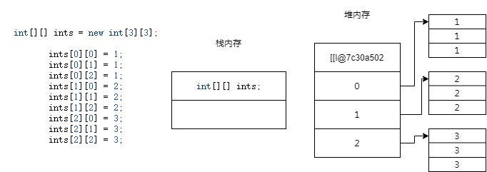

# 数组概念

` 数组 `：**同种数据类型** 组成的、**固定长度** 的、内存中 **连续存放** 的若干条数据

数组是引用数据类型，引用数据类型必须通过关键字 `new` 创建

数组的声明分为三种，以 `int` 数组作为示例

```java
/* 确定数组长度，声明与赋值分离 */
int[] array1 = new int[3];
/* 声明并赋值，通过赋值的数据确定数组的长度 */
int[] array2 = new int[]{1, 2, 3};
/* 写法上，相较于第二种，更为简洁 */
int[] array3 = {1, 2, 3};
```

**数组的类型、长度一旦确定，则不可更改**，这需要与其它语言中的数组区分开

# 多维数组

数组中，存在一维数组、二维数组等等，二维以上的数组，统称为**多维数组**

本质上，多维数组依旧可以看作是一维数组



简单的理解为，一维数组中的三个元素，是三个数组，**将数组类型作为数组内的元素**

# 栈堆分析

**数组存储的内存分析**：栈堆内存分析

数组是引用类型，内存中的存储方式与原始类型不同  

简单的理解为，数组有两块内存空间，分别存在于栈、堆

- 栈内存：存放堆内存的实际引用地址
- 堆内存：存放实际的数据

原始类型的变量名、数据内容都是存放在栈内存中

引用类型的实际数据是存放在堆内存中，由变量名指向  


上述图片引用自 Rust

可以看出，数组的数据是存放在堆内存中的（第二块图），变量名指向实际的堆内存地址  

当同种类型、不同长度的数组相互赋值时，仅需要 **更改指向地址即可**

当一块 **堆内存不再被栈内存指向**，则该内存会被自动释放，由虚拟机负责回收