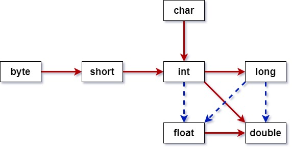

# 类型转换

**彼此兼容的类型之间，可以相互转换**，兼容类型的大小比较则根据其内存空间判断

1. **自动隐式** 转换：无须声明，例如 int 类型变量接收 byte 类型变量
2. **强制显式** 转换：需要声明，例如 byte 类型变量接收 int 类型变量

对于原始数据类型之间的转换，需要注意参与其中的是 **变量，还是字面量**

## 对于字面量

以整数为例，其默认的字面量的类型是 int，此时以一个 byte 接收整数字面量

`byte a = 100;`

此时，发生的是自动隐式转换，100 未超出 byte 的取值，可以由 int 类型转为 byte 类型

但是，若 byte 接收的整数字面量超出了取值范围，例如 `byte a = 200;`

此刻，产生的就是强制显式转换，需要手动声明转换的类型 `byte a = (byte) 200;`

简单的理解为，当 byte 接收一个兼容类型的整数字面量时，存在两种情况
- 未超出 byte 的取值：整数字面量由 int 自动隐式转换为 byte `byte a = 100;`
- 已超出 byte 的取值：必须进行显式的强制转换 `byte b = (byte) 200;`

基于字面量在类型转换中的表现，需要注意一个问题

字面量默认 int 类型，若 long 类型变量接收了超出 int、小于 long 的整数字面量，必须后缀 `L`，提升该整数字面量的类型为 long

## 对于变量

在变量的数据类型转换中，则无须在意整型、浮点型的默认字面量类型

任何不同类型的变量之间，由大向小转换，都必须强制声明、强制转换

`int a = 100;`

`byte b = (byte) a;`

int 是三十二位二进制，byte 是八位二进制，转换的时候必然产生影响

# 数据溢出

在强制类型转换中，会导致一些令人疑惑的问题，这称为 **数据溢出**

最简单的例子就是，`byte a = 400;`

整数字面值的默认类型是 `int`，且赋值的字面量超出 `byte` 取值，无法自动转换

此刻，会发生如下情况

先理解四个概念
- 符号位：二进制中，最高位作为符号位存在，0 为正，1 为负
- 原码：数据的直接二进制表示，以十进制 127 为例，目标为八位二进制
  - `+` 127：01111111 原码
  - `-` 127：11111111 原码
- 反码：在原码的基础上，全部取反，包括最高符号位
  - `+` 127：10000000 原码 -> 取反
  - `-` 127：00000000 原码 -> 取反 
- 补码：在反码的基础上，二进制数 加 1
  - `+` 127：10000001 取反 -> 补码 
  - `-` 127：00000001 取反 -> 补码

数据溢出问题，是由二进制截断、符号位、原码、反码、补码组成

简单的理解：**负数的二进制表现，是其对应正数的补码**

- 正数的二进制，就是它的原码表现形式
- 负数的二进制，则是它对应的正数的补码表现形式

强制转换的最终结果，以字节型为例，它由八位二进制组成

若接收的数据的二进制表现已超出八位时，则对超出部分进行截断（注意最高位符号位）

此处，需要注意最高位，即符号位，**正数可能在截断后转为负数**，这也是为什么正数溢出后，会出现负数的原因

若二进制符号位为 0，则直接按原码，求出结果

若二进制符号位为 1，则当作补码，反推回原码，根据对应的正数，求出负数结果

**负数的真正二进制表现，是其对应正数的补码表现**

```java
byte b = (byte) 400;
System.out.println(b);
/*
b 的最终结果为 -112
b 的二进制体现：110010000
截断为八位二进制：110010000 -> 10010000
112 的原码表现：01110000（八位二进制）
112 的补码表现：01110000 -> 取反 10001111 -> 补码 10010000
可以看出 + 112 的补码 = - 122 的原码
*/
```

# 小结

值得注意的是，浮点型中，存在精度的概念，double 字面量无法向下自动隐式转为 float



> 红色实线：内存存储自小向大转换，无损失，自动转换
>
> 蓝色虚线：内存存储自大向小转换，精度损失，强制转换
