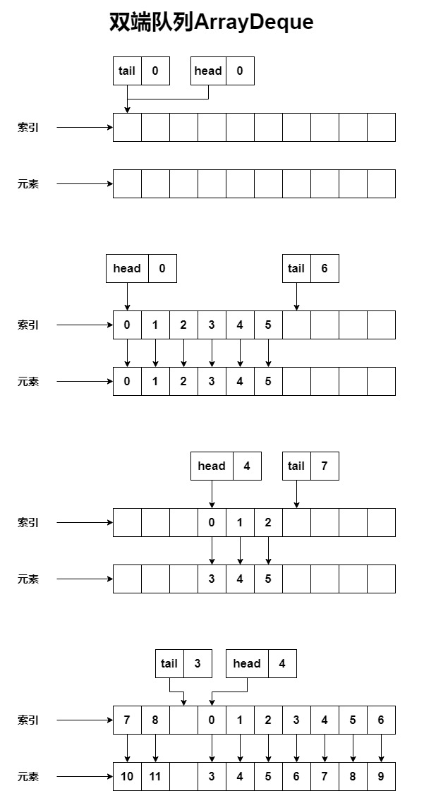

# 基本使用

ArrrayDeque，实现了 Deque 接口、间接实现了 Queue 接口、

- `public class ArrayDeque<E> extends AbstractCollection<E> implements Deque<E>, Cloneable, Serializable {}`
- `public interface Deque<E> extends Queue<E> {}`

ArrayDeque 是对于 ArrayList 的补充，二者都是的底层都是基于数组实现的

Deque，双端队列，可以对两端的元素做修改操作，且存在较高的效率

基于此，**ArrayDeque在对于两端元素操作时，不会存在大量的元素移动**

可以简单的理解，双端队列下的数组，首、尾操作方便，就好似一个 **可循环数组**

ArrayDeque 可以说是 ArrayList、LinkedList 的结合，达到了二者的均衡

```java
ArrayList<Integer> arrayList = new ArrayList<>();
long startTime = System.currentTimeMillis();
for (int i = 0; i < 100 * 100 * 10; i++) {
	arrayList.add(0, i);
}
long endTime = System.currentTimeMillis();
System.out.println("用时：" + (endTime - startTime) + " 毫秒");
```

```java
LinkedList<Integer> linkedList = new LinkedList<>();
long startTime2 = System.currentTimeMillis();
for (int i = 0; i < 100 * 100 * 10; i++) {
	linkedList.add(0, i);
}
long endTime2 = System.currentTimeMillis();
System.out.println("用时：" + (endTime2 - startTime2) + " 毫秒");
```

```java
ArrayDeque<Integer> arrayDeque = new ArrayDeque<>();
long startTime1 = System.currentTimeMillis();
for (int i = 1; i < 100 * 100 * 100; i++) {
	arrayDeque.addFirst(i);
}
long endTime1 = System.currentTimeMillis();
System.out.println("用时：" + (endTime1 - startTime1) + " 毫秒");
```

上述代码，分别是 ArrayList、LinkedList、ArrayQueue 对于头部元素插入的示例

可以很清晰的看出，ArrayList 在头部元素的插入上，表现不佳，极为耗时

而 ArrayDeque，它在元素的访问、添加操作上，都存在着较高的效率，表现适中

基于双端队列实现的ArrayDeque，在逻辑理解上，就好像是一个 **循环数组**

ArrayDeque可以从头部、尾部直接操作元素，首尾形成了闭环

现在，姑且将 ArrayDeque 看作是循环数组，它的首、尾元素修改方便

**在源码分析时，注意 ArrayDeque、ArrayList 二者的区别**

直接开始对于 ArrayDeque 的源码的分析，至于其中的常用方法，请翻阅 API 手册

# 初始化

```java
// elements：存储容器元素的数组
transient Object[] elements;

// 初始化，即默认存储数组的长度为 16
public ArrayDeque() {
	elements = new Object[16];
}
```

相对于 ArrayList 的初始化空数组，ArrayDeque 初始化的数组长度默认为 16

当然，ArrayDeque 中也是提供了有参构造，可以指定初始化时的默认数组长度

`ArrayDeque(int numElements) {}`

# 添加元素


```java
public boolean add(E e) {
	addLast(e);
	return true;
}
```

这是 ArrayDeque 的元素添加，注意 `addLast(e);`，元素默认添加至尾部

```java
public void addLast(E e) {
	if (e == null)
		throw new NullPointerException();
	final Object[] es = elements;
	es[tail] = e;
	if (head == (tail = inc(tail, es.length)))
		grow(1);
}
```

**ArrayDeque 的源码较为复杂，LinkedList 的节点类不过如此【狗头】**

这里先分析源码的执行，也画一张图，理解理解



`transient int tail;`：尾部的元素的索引 + 1

`transient int head;`：头部元素的索引

理解双端队列 ArrayDeque，必须理解 `tail`、`head`

结合上图，可以很清晰的认识到二者的定位

head：指向头部元素的索引位置

tail：指向下一个尾部元素的索引位置，即当前尾部元素的索引 + 1

**在双端队列中，头部元素不一定是存放在头部，也可能在中间位置**

但是，head、tail 的值，是遵循常规的数组索引位置，自左向右递增

不清楚的部分概念，可以反复参考上述图例

现在，再看向ArrayDeque的元素添加，结合之前的理解，进行分析

```java
public void addLast(E e) {
	if (e == null)
		throw new NullPointerException();
	// 建立空数组，引用自 elements 数组
	final Object[] es = elements;
	// 将添加的元素放至存储数组的头部位置
	es[tail] = e;
	if (head == (tail = inc(tail, es.length)))
		grow(1);
}
```

```java
static final int inc(int i, int modulus) {
	if (++i >= modulus) i = 0;
	return i;
}
```

```java
private void grow(int needed) {
	// oldCapacity：存储当前数组的长度，即当前容量
	final int oldCapacity = elements.length;
	// 扩容的新数组
	int newCapacity;
	// 容量是否小于 64
	// 若小于，扩容 2 个长度；若大于则扩容至 1.5 倍
	int jump = (oldCapacity < 64) ? (oldCapacity + 2) : (oldCapacity >> 1);
	// MAX_ARRAY_SIZE：实际为 Integer.MAX_VALUE - 8;
	// jump < needed 为 false，传入的 needed 为 1，jump 最小为 2
	// 核心：扩容后的新数组 newCapacity 是否大于 MAX_ARRAY_SIZE
	if (jump < needed || (newCapacity = (oldCapacity + jump)) - MAX_ARRAY_SIZE > 0)
		// 扩容新数组超出 Integer.MAX_VALUE - 8
		// newCapacity 可以扩容的最大值 Integer.MAX_VALUE
		newCapacity = newCapacity(needed, jump);
	// es 数组拷贝，elements 拷贝，这一步已经完成了扩容
	final Object[] es = elements = Arrays.copyOf(elements, newCapacity);
	// 核心：head 是否大于 0，即头部元素是否存在于最前端
	if (tail < head || (tail == head && es[head] != null)) {
		int newSpace = newCapacity - oldCapacity;
		// 若头部元素并非在第一个位置，则整体向后移动
		System.arraycopy(es, head, es, head + newSpace, oldCapacity - head);
		for (int i = head, to = (head += newSpace); i < to; i++)
			es[i] = null;
	}
}
```

```java
// 扩容新数组，数据溢出时使用
private int newCapacity(int needed, int jump) {
	// oldCapacity 获得 elements 长度，并创建 int 变量 minCapacity
	final int oldCapacity = elements.length, minCapacity;
	// 当前数组长度 + 1，大于 Integer.MAX_VALUE - 8
	if ((minCapacity = oldCapacity + needed) - MAX_ARRAY_SIZE > 0) {
		// 这个真的可以满足吗，异常可以执行吗
		if (minCapacity < 0)
			throw new IllegalStateException("Sorry, deque too big");
		// 返回扩容的极限值 Integer.MAX_VALUE
		return Integer.MAX_VALUE;
	}
	if (needed > jump)
		return minCapacity;
	return (oldCapacity + jump - MAX_ARRAY_SIZE < 0)
		? oldCapacity + jump
		: MAX_ARRAY_SIZE;
}
```

好了，到这里可以看出 ArrayDeque 的具体扩容操作了

并且，也理解了双端队列，或者说循环数组的概念

这里，总结关于 ArrayDeque 的要点，不再结合相应源码做分析

1. 索引 0 的元素，并非固定在最左侧，索引位置与实际位置不一致
2. 删除头部、尾部元素，不会造成数组元素的整体变化
3. 在 ArrayList 中，若删除头部元素，则所有元素前移一位，消耗极大

具体的双端队列，可以直接查看上述的图例，它的索引与位置的关系

ArrayDeque 不是根据索引位置获取数值，不存在 `get()`，注意与 ArrayList 的区别
