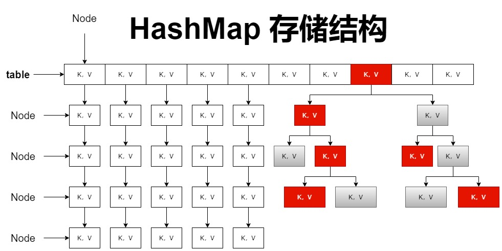

# 基本使用

对于 HashMap 的使用，主要是演示不同的操作方式，区别于 List 列表容器

具体的初始化、元素添加，会直接结合源码分析

对于更多的 API 使用，请参考官方提供的 API 手册

```java
// 创建 HashMap 对象
HashMap<Integer, String> hashMap = new HashMap<>();

// 添加元素
hashMap.put(0,"A");
hashMap.put(1,"B");
hashMap.put(2,"C");
hashMap.put(4,"D");

// 容器是否为空
System.out.println(hashMap.isEmpty());

// 取出元素
System.out.println(hashMap.get(2));

// 删除元素
hashMap.remove(3);

// 获取所有的键 K
System.out.println(Arrays.toString(hashMap.keySet().toArray()))
```

# 初始化

**无参初始化**

```java
public HashMap() {
	// 负载因子的值默认为加载因子的值，0.75f
	this.loadFactor = DEFAULT_LOAD_FACTOR;
}
```

HashMap 的初始化容量也是空，再次声明，**源码的阅读需结合具体的 JDK 版本**

**有参构造函数**

```java
public HashMap(int initialCapacity) {
	// 指定初始容量、负载因子
	this(initialCapacity, DEFAULT_LOAD_FACTOR);
}
```

`transient Node<K,V>[] table;`：负责存储键值对，以数组的形式

`final float loadFactor;`：负载因子

**负载因子的大小，是 `table` 已经使用的容量的百分比**

**负载因子，在无参初始化时，设置为 0.75 加载因子，即负载因子默认为 0.75**

`static final float DEFAULT_LOAD_FACTOR = 0.75f;`：加载因子

`int threshold;`：容量阙值， 计算公式 ： **table * loadFactor = threshold**

# 节点类

HashMap 的哈希表，是由数组、单向链表组成

`table` 中直接存储一组数组，而数组中的每个元素可以拓展为一个单向链表

在 HashMap 中，存在两个节点类 `Node`、`TreeNode`

数组、单向链表中的元素，都是一个 Node 类，table 是 Node 类型的数组

**当单向链表长度为 8 时，会转换为树形结构，此时会用到 TreeNode**



**源码分析，自此之后，会精简代码，完全版请直接参考 JDK 源码**

```java
// Node 节点类，以 K，V 键值对的形式存储元素
static class Node<K,V> implements Map.Entry<K,V> {
	// hash：该 Node 类在内存中的地址值
	final int hash;
	final K key;
	V value;
	// next：指向下一个可能存在的 Node 节点
	Node<K,V> next;

	// 判断节点类对象是否相同
	public final boolean equals(Object o) {
		if (o == this)
			return true;
		if (o instanceof Map.Entry) {
			Map.Entry<?,?> e = (Map.Entry<?,?>)o;
			if (Objects.equals(key, e.getKey()) &&
				Objects.equals(value, e.getValue()))
				return true;
		}
		return false;
	}
}
```

```java
static final class TreeNode<K,V> extends LinkedHashMap.Entry<K,V> {
	// 父节点
	TreeNode<K,V> parent;
	// 左节点
	TreeNode<K,V> left;
	// 右节点
	TreeNode<K,V> right;
	// 下一节点
	TreeNode<K,V> prev;
	// true 为红树；false 为黑树
	boolean red;
	TreeNode(int hash, K key, V val, Node<K,V> next) {
		super(hash, key, val, next);
	}
}
```

# 为空扩容

HashMap 初始化时，默认 Node 数组为空，在添加第一个键值对时，存在默认扩容

```java
final V putVal(int hash, K key, V value, boolean onlyIfAbsent, boolean evict) {
	Node<K,V>[] tab; Node<K,V> p; int n, i;
	// 若table数组为空，则该分支执行，默认扩容，核心为 
	if ((tab = table) == null || (n = tab.length) == 0)
		n = (tab = resize()).length;
	}
}
```

```java
final Node<K,V>[] resize() {
	Node<K,V>[] oldTab = table;
	// 此时数组为空，获得的是 0
	int oldCap = (oldTab == null) ? 0 : oldTab.length;
	int oldThr = threshold;
	int newCap, newThr = 0;
	if (oldCap > 0) {
	}
	else if (oldThr > 0)
	// 初始阙值为零，即 table 为 null，该分支执行
	// DEFAULT_INITIAL_CAPACITY = 1 << 4
	else {
		// 此次扩容为 16
		newCap = DEFAULT_INITIAL_CAPACITY;
		// 负载因子为 12
		newThr = (int)(DEFAULT_LOAD_FACTOR * DEFAULT_INITIAL_CAPACITY);
	}
	@SuppressWarnings({"rawtypes","unchecked"})
	Node<K,V>[] newTab = (Node<K,V>[])new Node[newCap];
	// 数组扩容完毕
	table = newTab;
	return newTab;
}
```

在首次添加键值对时，将 table 的容量扩充为 16，负载因子占比 7.5，值为 12

# 计算 hash 值

每一个数组中的 Node 节点，都存在一个唯一的 hash 值

此数组所代表的单向链表中的Node节点，具有相同的hash值

```java
// 添加元素，其中的 key 作为哈希值运算
public V put(K key, V value) {
	return putVal(hash(key), key, value, false, true);
}
```

```java
// 将 key 通过一系列的运算，转换为 hash 值返回
static final int hash(Object key) {
	int h;
	// 若 key 为 0，则放置在数组 Node 节点的首位
	// hash 值的计算，具体涉及到 hashCode()、按位异或、无符号右移
	return (key == null) ? 0 : (h = key.hashCode()) ^ (h >>> 16);
}
```

以下是按位异或的使用，对于这二者，可以参考 [语言基础](01、语言基础.md)

```java
// 按位异或 `^`：相同为 0，不同为 1
System.out.println(16 ^ 7);
/*
原码 16：00000000 00000000 00000000 00010000
原码  7：00000000 00000000 00000000 00000111
按位异或：00000000 00000000 00000000 00010111
*/
```

简单的理解，hashMap 的为空扩容，容量是 16，那么 hash 值就是 **hashCode% 数组长度**

**hash 值可能存在重复，重复的键值对以单向链表的结构存储**

# 元素添加

```java
// 第一步：放入键值对 K，V
public V put(K key, V value) {
	return putVal(hash(key), key, value, false, true);
}
```

```java
// 第二步：确定存储位置
/*
hash：key 的哈希值
key：键
value：值
onlyIfAbsent：若为 true，则不更改原有值
evict：若为 false，table 处于创建模式
*/
final V putVal(int hash, K key, V value, boolean onlyIfAbsent, boolean evict) {
	// tab：接收 table 数组；
	Node<K,V>[] tab; Node<K,V> p; int n, i;
	// 判断 table 数组中的某个位置是否为空，根据 hash 值选定
	if ((p = tab[i = (n - 1) & hash]) == null)
		// newNode.. 创建常规的数组 Node 节点类
		tab[i] = newNode(hash, key, value, null);
	// 若当前数组位置已存在元素，则向单向链表追加
	else {
		Node<K,V> e; K k;
		// 判断键是否相同
		if (p.hash == hash && ((k = p.key) == key || (key != null && key.equals(k))))
			e = p;
		// 判断该节点是否是树节点，即由单向链表转为红黑树
		else if (p instanceof TreeNode)
			// 添加为树节点
			e = ((TreeNode<K,V>)p).putTreeVal(this, tab, hash, key, value);
		else {
			// 依旧为单向链表，循环添加至链表的末尾位置
			for (int binCount = 0; ; ++binCount) {
				if ((e = p.next) == null) {
					// 将传入的键值对存储为下一个节点
					p.next = newNode(hash, key, value, null);
					if (binCount >= TREEIFY_THRESHOLD - 1)
						treeifyBin(tab, hash);
					break;
				}
				if (e.hash == hash && ((k = e.key) == key || (key != null && key.equals(k))))
					break;
				p = e;
			}
		}
		// 若键重复，则覆盖 Value 值
		if (e != null) {
			V oldValue = e.value;
			if (!onlyIfAbsent || oldValue == null)
				e.value = value;
			afterNodeAccess(e);
			return oldValue;
		}
	}
}
```


# 链表转树

在一定的条件下，单向链表会被转换为红黑树结构

之后，新的键值对会以树节点的形式存储

```java
final V putVal(int hash, K key, V value, boolean onlyIfAbsent, boolean evict) {
	else {
		else {
			for (int binCount = 0; ; ++binCount) {
				if ((e = p.next) == null) {
					// 创建新的节点，此处已完成元素添加
					p.next = newNode(hash, key, value, null);
					// 判断当前是否满足单向链表转树的条件
					// TREEIFY_THRESHOLD = 8
					if (binCount >= TREEIFY_THRESHOLD - 1)
						treeifyBin(tab, hash);
					break;
				}
			}
		}
	}
}
```

```java
final void treeifyBin(Node<K,V>[] tab, int hash) {
	int n, index; Node<K,V> e;
	// 单向链表转为树结构，必须使得 table 长度大于 64，否则继续扩容
	// MIN_TREEIFY_CAPACITY = 64
	if (tab == null || (n = tab.length) < MIN_TREEIFY_CAPACITY)
		resize();
	else if ((e = tab[index = (n - 1) & hash]) != null) {
		TreeNode<K,V> hd = null, tl = null;
		do {
			TreeNode<K,V> p = replacementTreeNode(e, null);
			if (tl == null)
				hd = p;
			else {
				p.prev = tl;
				tl.next = p;
			}
			tl = p;
		} while ((e = e.next) != null);
		if ((tab[index] = hd) != null)
			hd.treeify(tab);
	}
}
```

单向链表转为红黑树结构，必须满足两点

1. 常规数组节点下的单向链表，长度必须大于等于 7
2. 数组 table 的长度必须大于等于 64，即存在 63 个常规数组节点

# 数组扩容

table 的为空扩容，默认长度是 16

```java
final Node<K,V>[] resize() {
	Node<K,V>[] oldTab = table;
	// 数组 table 是否为 null，即为空扩容
	int oldCap = (oldTab == null) ? 0 : oldTab.length;
	int oldThr = threshold;
	int newCap, newThr = 0;
	if (oldCap > 0) {
		// 扩容至极限 Integer.MAX_VALUE
		if (oldCap >= MAXIMUM_CAPACITY) {
			threshold = Integer.MAX_VALUE;
			return oldTab;
		}
		// 扩容为原来的二倍
		else if ((newCap = oldCap << 1) < MAXIMUM_CAPACITY && oldCap >= DEFAULT_INITIAL_CAPACITY)
			newThr = oldThr << 1;
	}
	else if (oldThr > 0)
		newCap = oldThr;
	// 数组的为空扩容
	else {
		newCap = DEFAULT_INITIAL_CAPACITY;
		newThr = (int)(DEFAULT_LOAD_FACTOR * DEFAULT_INITIAL_CAPACITY);
	}
	if (newThr == 0) {
		float ft = (float)newCap * loadFactor;
		newThr = (newCap < MAXIMUM_CAPACITY && ft < (float)MAXIMUM_CAPACITY ?
					(int)ft : Integer.MAX_VALUE);
	}
	threshold = newThr;
	@SuppressWarnings({"rawtypes","unchecked"})
	Node<K,V>[] newTab = (Node<K,V>[])new Node[newCap];
	table = newTab;
	if (oldTab != null) {
		for (int j = 0; j < oldCap; ++j) {
			Node<K,V> e;
			if ((e = oldTab[j]) != null) {
				// 新、老数组元素的拷贝迁移
		}
	}
	// 返回扩容后的新数组
	return newTab;
}
```

对于 HashMap 容器的扩容，存在三点

1. 为空扩容，扩容至 16
2. 非空扩容，每次 **扩容二倍**
3. 极限扩容，扩容至最大 Integer.MAX_VALUE

# 红黑自平衡