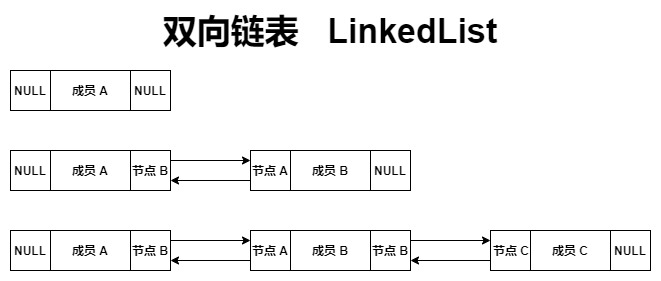

### 基本使用

`LinkedList` 的底层基于 ` 双向链表 ` 实现，这与 `Arraylist`、`Vector` 的 ` 数组 ` 实现是不同的

基于 ` 双向链表 ` 实现的 `LinkedList` 具有如下的特点

- 数据元素的增加、删除操作较快，它的 **修改、删除效率高**
- 相对于数组实现的 `ArrayList` ，它的 **查询、添加效率低**
- 相对于线程安全的 `Vector` ，它的 **线程不安全**

```java
ArrayList<Integer> arrayList = new ArrayList<>();
long startTime1 = System.currentTimeMillis();
for (int i = 0; i < 100 * 100 * 100; i++) {
	arrayList.add(i);
}
long endTime1 = System.currentTimeMillis();
System.out.println("ArrayList 用时：" + (endTime1 - startTime1) + " 毫秒");
```

```java
LinkedList<Integer> linkedList = new LinkedList<>();
long startTime2 = System.currentTimeMillis();
for (int i = 0; i < 100 * 100 * 100; i++) {
	linkedList.add(i);
}
long endTime2 = System.currentTimeMillis();
System.out.println("LinkedList 用时：" + (endTime2 - startTime2) + " 毫秒");
```

上述的代码，是测试 ArrayList、LinkedList 在插入元素时的时间消耗

同样的，也可以用于测试修改元素的时间消耗

这可以很明确的认识到：数组、链表这两个数据结构的差异

同样继承自 `List` 接口的 `LinkedList` 容器，**扩展方法** 如下

- `void addFirst(E e)` ：将指定元素插入到开头位置
- `void addLast(E e)` ：将指定元素插入到结尾位置
- `getFirst()` ：返回列表的第一个元素
- `getLast()` ：返回列表的最后一个元素
- `removeFirst()` ：移除列表的第一个元素，并返回该元素
- `removeLast()` ：移除列表的最后一个元素，并返回该元素
- `E pop()` ：弹出列表的第一个元素
- `void push(E e)` ：添加元素至列表的开头位置
- `boolean isEmpty()` ：判断列表是否为空

可以看出，链表实现的 `LinkedList`，在继承 `List` 接口的同时，拓展了独有方法

`LinkedList` 的使用案例

```java
LinkedList<String> linkedList = new LinkedList<>();

// 添加元素至列表的开头、结尾
linkedList.addFirst("A");
linkedList.addFirst("B");
linkedList.addFirst("C");
linkedList.addLast("D");

// 获取此列表的第一个元素、最后一个元素
System.out.println(linkedList.getFirst());
System.out.println(linkedList.getLast());

// 移除该列表的第一个元素、最后一个元素，并返回
System.out.println(linkedList.removeFirst());
System.out.println(linkedList.removeLast());
for (String s : linkedList) {
	System.out.println(s);
}

// 弹出该列表的第一个元素 removeFirst()
System.out.println(linkedList.pop());

// 添加元素至列表的开头位置 addFirst()
linkedList.push("E");

// 判断列表是否为空
System.out.println(linkedList.isEmpty());
```

值得注意的是，inkedList 除了实现 List 接口，还实现了 Deque 接口

而其中的 Deque 接口，则实现了 Queue 接口

### 实现 Deque

LinkedList直接实现了Deque接口，这是一个双端队列

对于双端队列，它同时具有栈、队列的特征，需要区分开

双端队列，可以在头部、尾部操作数据元素

Deque扩展了如下的方法

- `void push()`：头部添加元素，栈溢出则抛出异常
- `E push(E e)`：查询头部元素，栈为空则返回NULL
- `E pop()`：查看并删除头部元素，栈为空则抛出异常

```java
Deque<Integer> deque = new LinkedList<>();
deque.push(1);
deque.push(2);
System.out.println(deque.size());
```

### 实现 Queue

LinkedList 间接实现了 Queue 接口，这是一个队列

值得注意的是，Queue 接口也继承了 Collection 类，并扩展了一些方法

Queue接口扩展的方法

- `boolean add(E e)`：尾部添加元素
- `boolean offer(E e)`：尾部添加元素
- `E element()`：查询头部元素，但不删除
- `E peek()`：查询头部元素，但不删除
- `E pull()`：查询头部元素，并删除
- `E remove()`：查询头部元素，并删除

```java
Queue<Integer> integers = new LinkedList<>();
integers.add(1);
integers.add(2);
System.out.println(integers.size());
```

### 节点对象

对于 `LinkedList` 源码的分析，是与 `ArrayList`、`Vector` 存在较大差异的

`LinkedList` 基于双向链表实现，而每个存储单元，都存在两个首、尾节点

`LinkedList`的节点类：私有、静态、内部类

```Java
private static class Node<E> {
	// item：数据元素
	E item;
	// next：下一个节点、尾节点
	Node<E> next;
	// prev：上一个节点、首节点
	Node<E> prev;

	// 建立一个链表存储单元，存在数据元素、两个指向节点
	Node(Node<E> prev, E element, Node<E> next) {
		this.item = element;
		this.next = next;
		this.prev = prev;
	}
}
```

### 节点添加

`LinkedList` 的元素添加：正常添加，了解节点类的使用

```java
// 添加元素，在尾部插入节点
public boolean add(E e) {
	linkLast(e);
	return true;
}

// 插入尾节点
void linkLast(E e) {
	// last：指向后一个节点的指针，开始默认为NULL
	final Node<E> l = last;
	// 新建节点对象，填入数据元素
	final Node<E> newNode = new Node<>(l, e, null);
	// 将新建的节点对象，赋值给last指针
	last = newNode;
	// 判断是否存在下一个节点
	if (l == null)
		// 若不存在下一节点，将当前节点设为尾节点
		first = newNode;
	else
		// 若存在下一节点，将当前节点设为上一节点
		l.next = newNode;
	// size：记录双向链表的节点个数，等同于记录数据元素的个数
	size++;
	modCount++;
}
```

双向链表的节点，理解确实是有些麻烦



现在，向 `LinkedList` 中插入三个数据元素，成员 A、B、C

添加元素（成员 A）：首、尾节点为 NULL

```java
void linkLast(E e) {
	// last：记录最后一个节点对象，此时为 NULL
	final Node<E> l = last;
	// 新建节点对象，首、尾节点为 NULL
	final Node<E> newNode = new Node<>(l, e, null);
	// 当前节点对象，赋值给 last 指针
	last = newNode;
	if (l == null)
		// first：记录了第一个节点对象
		// 此时，将成员 A 记录为了第一个节点对象
		first = newNode;
	else
		l.next = newNode;
	size++;
	modCount++;
}
```

添加元素（成员 B）：存在上一节点，成员 A

```java
void linkLast(E e) {
	// last 指针记录了上一节点对象，成员 A
	final Node<E> l = last;
	// 新建节点对象，存在上一节点，下一节点为 NULL
	final Node<E> newNode = new Node<>(l, e, null);
	// 当前节点对象为成员 B，赋值给 last 指针
	last = newNode;
	if (l == null)
		first = newNode;
	else
		// 将上一节点对象的尾节点设置为当前节点对象
		// 成员 A 的下一节点由 NULL 更改为成员 B
		l.next = newNode;
	size++;
	modCount++;
}
```

添加元素（成员 C）：存在上一节点，成员 B

```java
void linkLast(E e) {
	// last 指针记录了上一节点对象，成员 B
	final Node<E> l = last;
	// 新建节点对象，存在上一节点，下一节点为 NULL
	final Node<E> newNode = new Node<>(l, e, null);
	// 当前节点对象为成员 C，赋值给 last 指针
	last = newNode;
	if (l == null)
		first = newNode;
	else
		// 将上一节点对象的尾节点设置为当前节点对象
		// 成员 B 的下一节点由 NULL 更改为成员 C
		l.next = newNode;
	size++;
	modCount++;
}
```

上述是对于 `LinkedList` 元素添加的源码分析，核心在于节点对象的首尾、前后节点指针

---

`LinkedList` **添加头部节点**：void addFirst(E e);

```java
public void addFirst(E e) {
	linkFirst(e);
}

private void linkFirst(E e) {
	// first：记录了第一个节点对象
	// 注意，任意方式添加的第一个节点对象，同时赋值给 last、first
	final Node<E> f = first;
	// 建立节点对象，前后节点为 NULL，存储数据元素
	final Node<E> newNode = new Node<>(null, e, f);
	// 当前节点对象，赋值给first，作为第一个节点对象
	first = newNode;
	if (f == null)
		// 若LinkedList只存在当前一个节点对象，则作为首、尾节点对象存在
		last = newNode;
	else
		// 若存在其它的节点对象，则作为当前对象的下一节点对象
		f.prev = newNode;
	size++;
	modCount++;
}
```

从 `LinkedList` 添加头部节点，可以很清晰的认识到

- 任何方式添加的第一个节点对象，会同时作为首尾节点存在，并赋值给 `first`、`last`
- `first` 指针，指向第一个节点对象，首节点的前驱元素为 NULL
- `last` 指针，指向最后一个节点对象，尾节点的后继元素为 NULL
- 除首、尾节点对象外，其余皆存在前、后节点对象

---

`LinkedList` **添加指定节点**：void add(int index, E element) {};

```java
public void add(int index, E element) {
	// 判断输入的位置，是否存在问题
	checkPositionIndex(index);
	// 若 index==size，则是作为最后一个节点存在，正常调用 linkLast()
	// 考虑到了，插入的节点是第一个节点的可能，nice！！
	if (index == size)
		linkLast(element);
	else
		// 否则调用 linkBefore(element, node(index))
		linkBefore(element, node(index));
}

// 判断是否存在问题，抛出的异常为 数组索引越界异常
private void checkPositionIndex(int index) {
	if (!isPositionIndex(index)) throw new IndexOutOfBoundsException(outOfBoundsMsg(index));
}

// 添加指定节点时，index 必须大于、等于 0，小于当前的总节点数
private boolean isPositionIndex(int index) {
	// size：记录当前的节点数，LinkedList 中已存在的节点对象的总数
	return index >= 0 && index <= size;
}

void linkBefore(E e, Node<E> succ) {
	// 获取插入节点的前一节点对象
	final Node<E> pred = succ.prev;
	// 建立新的节点对象
	final Node<E> newNode = new Node<>(pred, e, succ);
	succ.prev = newNode;
	// 若插入的节点不存在上一节点对象，即该节点为首节点
	if (pred == null)
		first = newNode;
	else
		pred.next = newNode;
	size++;
	modCount++;
}

Node<E> node(int index) {
	// 判断节点插入的大致位置
	if (index < (size >> 1)) {
		// 建立新的节点对象，并赋值为首节点的节点对象
		// 首节点指针已经在之前，去除了为 NULL 的可能
		Node<E> x = first;
		for (int i = 0; i < index; i++)
			// 根据插入节点的位置，获取下一节点对象，自前向后
			x = x.next;
		return x;
	} else {
		Node<E> x = last;
		for (int i = size - 1; i > index; i--)
			// 获取插入节点的上一节点对象
			x = x.prev;
		return x;
	}
}
```

对于节点对象的指定插入，在实现上是较为复杂的，但原理是相似的

以上，是对于 `LinkedList` 的源码分析，大致是对于其中节点的作用的说明

正常元素添加、头部元素添加、指定位置元素添加]

值得注意的是，`LinkedList` 不存在初始大小，**按需分配空间，不作预先处理**

简单的理解，LinkedList 理论上不存在容量的限制，元素添加的效率较高

当然，每个对象由虚拟机分配的堆内存空间是有限的，不存在无限制的容量

它是基于链表实现的，在内存中，物理上存储是不连续的，通过节点，实现逻辑上的连续

**目前，LinkedList 基于双向链表，而非双向循环链表**

同时，LinkedList 也可以作为栈、队列使用，不局限于双向链表
