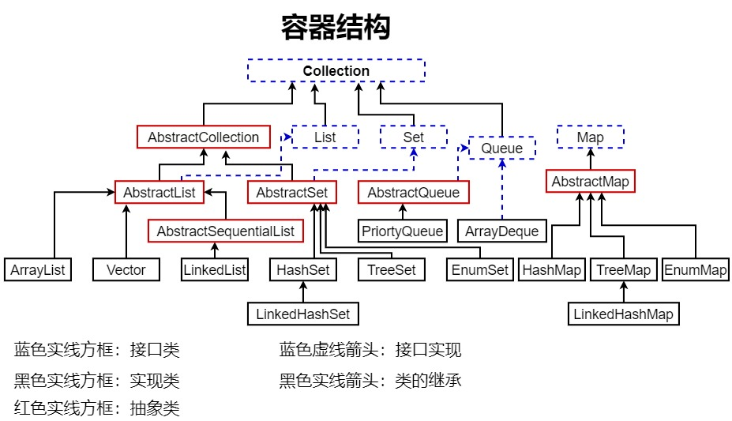

# 容器的概念

容器：容纳数据元素的器皿，但只存储引用类型对象

容器的概念与数组相似，都是为了存储数据而存在的，但容器的应用范围更为广泛

在 Java 的容器体系中，存在一个 `Collection` 接口，作为容器的顶级接口存在

由它派生出两个子接口 `List`、`Set`，同时，还存一个独立于该接口的容器接口 `Map`，也是容器的顶级接口

也就是说，Java 的容器中存在两个顶部接口，`Collection` 接口、`Map` 接口

> 详细的继承、实现关系，可以借助 IDEA 的图表功能查看，这里图片较为简略

`Collection` 接口定义的两个子接口 `List` 、`Set`，都是单例集合，每次只能存储一个数据元素

`Map` 接口则是双例集合，按照键值的 `K,V` 的形式，同时存储两个数据元素

> 对于 `Map`，第一个元素 ` 键 ` 相当于第二个元素 ` 值 ` 的地址

简单理解 List 列表容器中的索引下标与值，但 Map 中的键可以自由定义

在 `Collection` 接口中，定义了如下的公共方法

- `boolean add(Object element)` ：增加元素到容器内
- `boolean remove(Object element)` ：从容器中移除元素
- `boolean contains(Object element)` ：容器中是否包含该元素
- `int size()` ：容器中元素的个数
- `boolean isEmpty()` ：容器是否为空
- `void clear()` ：清空容器中的所有元素
- `Iterator iterator()` ：获取迭代器，遍历所有元素
- `boolean containsAll(Collection c)` ：本容器是否包含目标容器的所有元素
- `boolean addAll(Collection c)` ：将目标容器的元素加入到本容器中
- `boolean removeAll(Collection c)` ：移除本容器和目标容器都存在的元素
- `boolean retainAll(Collection c)` ：移除本容器和目标容器都不存在的元素
- `Object[] toArray()` ：转换为 `Object` 数组

基于 `Collection()` 接口定义的方法，可以发现，偏向于无序 `Set` 集合

# List 接口

`List` 接口存在两大特征

1. 数据元素 **有序存储**，存在索引下标
2. 数据元素 **重复存储**，存在相同元素

`List` 接口在继承 `Collection` 接口的基础上，扩展了如下方法

- `void add(int index, Object ekement)` ：指定位置插入元素，此后元素后移
- `Object set(int index, Object ekement)` ：修改指定位置的元素
- `Object get(int index)` ：返回指定位置的元素
- `Object remove(int index)` ：删除指定位置的元素，此后元素前移
- `int indexOf(Object o)` ：返回第一个匹配元素的索引，若不存在则为 -1
- `int lastIndexOf(Object o)` ：返回最后一个匹配元素的索引，不存在返回 -1

List 中扩展的方法，是需要索引下标的介入，数据元素是有序存储、取出

# Map 接口

之前提到过，`Map` 并没有继承 `Collection` 接口

Map 接口是独立存在的容器接口，而 Collection 接口下的实现类，为单例容器

对于Map的双例容器，也可以称为 **键值容器，以 `K`、`V` 的形式进行存储**

简单的理解，`Map` 每次存储的数据元素是成对出现的，而单例集合仅存在一个元素

对于 `Map` 容器中的**键 `K`**，可以 **简单的看作是列表容器的索引**，只是该“索引”可以自定义

`Map` 中的键、值，**键不可以重复**；**值可以重复**；且 **一个键对应一个值**

以下是 `Map` 中定义的常用方法

- `V put(K key, V value)`：添加元素，以 K、V 键值对的形式
- `V get(Object key)`：根据 key，获取 Value
- `V remove(Object key)`：删除指定 Key
- `boolean containskey(Object key)`：是否存在指定 Key
- `Set keySet()`：获取 Map 中的所有 key，存储入 Set 中
- `void clear()`：删除 Map 中的所有键值对

值得注意的是，`Map` 中的添加，已经有 **add()** 变更为了 **put()**

Map 接口、Collection 接口，需要注意使用上的差异

在 `Map` 集合中，常用的有 `HashMap`、`TreeMap`

# Set 接口

`Set` 接口存在两大特征

1. 数据元素 **无序存储**，不存在索引下标
2. 数据元素 **不可重复**，不存在相同元素

`Set` 接口并未扩展 `Collection` 接口的方法，这也是容器，可以被称为集合容器的缘由

未扩展 `Collection` 接口方法的 `Set` 接口，其内部方法无变动

- `boolean add(Object element)` ：增加元素到容器内
- `boolean remove(Object element)` ：从容器中移除元素
- `boolean contains(Object element)` ：容器中是否包含该元素
- `int size()` ：容器中元素的个数
- `boolean isEmpty()` ：容器是否为空
- `void clear()` ：清空容器中的所有元素
- `Iterator iterator()` ：获取迭代器，遍历所有元素
- `boolean containsAll(Collection c)` ：本容器是否包含目标容器的所有元素
- `boolean addAll(Collection c)` ：将目标容器的元素加入到本容器中
- `boolean removeAll(Collection c)` ：移除本容器和目标容器都存在的元素
- `boolean retainAll(Collection c)` ：移除本容器和目标容器都不存在的元素
- `Object[] toArray()` ：转换为 `Object` 数组