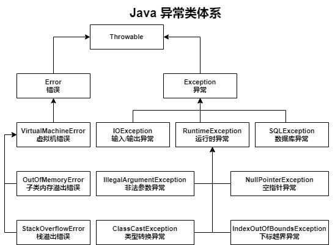

## 异常的概念

在 Java 中，不是所有的程序最终都可以正常的运行

简单的说，长度为 3 的数组，访问索引 3，这就是一个错误，数组索引下标越界异常

再例如，Java 操作数据库，编译时不可能确定你的信息是否填写正确

异常分为两类
- 错误 Error：错误，不可以被处理，只能在开发时注意
- 异常 Exception：可以被处理，也是主要介绍的部分

对于异常 Exception，又可以分为受检异常、运行时异常

受检异常：程序编译时检查，必须被处理的异常，否则编译不通过

运行时异常（未受检异常）：编译时无法确定的异常，例如空指针异常

运行时异常 RuntimeException 和错误 Error 一样，都是未受检异常，编译时无法确定



上图是 Java 的异常类体系，展示了部分主要、常见的异常类

## 异常的处理

之前谈到过，受检异常是可以被处理的

异常的处理分为两类，捕获异常、抛出异常

这里主要介绍异常的捕获处理

```java
try {

} catch () {

} finally {
	
}
```

- `try {}`：放置可能存在异常的程序代码
- `catch () {}`：匹配可能存在的异常信息
- `finally {}`：异常处理完成后，进行的操作

对于 `catch () {}`，负责预测可能发生异常的代码

```java
catch (Exception e) {}
```

`Expection`，是所有异常的父类，可以通过它直接匹配到所有可能出现的异常类型

当然，不建议这么做，尽可能的缩小异常的范围，精确匹配

支持多条 `catch () {}` 匹配，且多个异常类型通过 `|` 可以存在于一个 `catch () {}`

在异常匹配中，可以通过如下 API 查看异常
- `printStackTrace()`：打印出异常的堆栈信息
- `getMessage()`：打印出异常的提示信息

也可以直接打印，异常对象的字符串描述，其中包含异常信息、异常提示

值得注意的是，若产生的异常未能被 `catch () {}` 匹配处理，则后续代码不会被执行

在异常代码之后，还存在其它的程序代码

- 若异常被捕获处理，后续代码则会正常执行
- 若异常未被处理或向上抛出，则后续代码不会执行

这里，体现出了 `finally {}` 的作用，其中的代码，无论异常是否成功捕获，都会执行

## 异常的抛出

异常可以不再当前类中处理，抛出异常即可

异常的抛出存在两个关键字 `throws`、`throw`

- `throws`：向上抛出异常，追加在方法的后面
- `throw`：自定义异常，位于方法体内，可以追加异常提示

```java
// throws 示例
public static void main(String[] args) throws Exception{}
```

```java
// throw 示例
throw new Exception("异常提示信息");
```

值得注意的是，对于受检异常，`throw` 必须位于 `catch () {}` 中，或者使用 `throws`

## 自定义异常

Java 中定义了大量的异常类，也可以根据自己的需要，自定义更合适的异常类

```java
public class CustomException extends Exception{
    public CustomException() {
    }

    public CustomException(String message) {
        super(message);
    }
}
```

```java
throw new CustomException("自定义异常的提示信息");
```
