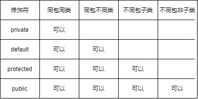

# 类的封装

类的三大特性，封装、继承、多态，其中，实现封装的关键字是 `private`

Java中，类的封装只有一个目的：**隐藏内部实现细节，提供功能实现**
- 对于内部，类的属性访问、修改不可直接进行，而是通过特定的方法 get、set
- 对于外部，只需要在意该类可以提供的功能，而不必要关心其内部细节

**喜欢吃鸡蛋，而不必在意鸡是下蛋的细节，这是封装的理解**

# 访问权限修饰符

Java 中的四个关键字 `private`、`default`、`protected`、`public`，作为访问权限修饰符存在

作用于类、属性、方法，代表着不同的可访问级别，具体的细节如下

以上，是详细的访问级别，当不添加访问修饰符时，默认为 default

对于 Java 中的 ` package 包 `，简单理解为文件夹即可，代表 Java 源文件存放的层次目录